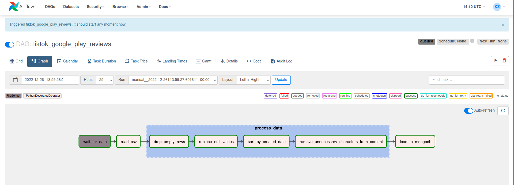
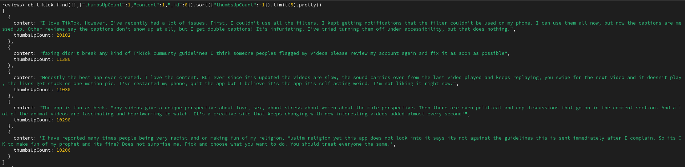
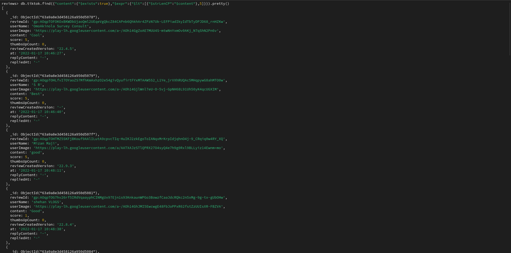
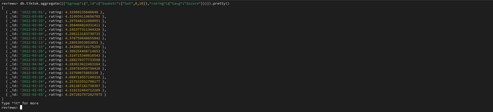

## Airflow

Quick guide on how to install Airflow locally:

* You should already have python and pip installed

```shell
pip install -r requirements.txt
```

```shell
airflow db init
```

```shell
airflow users create \
    --username admin \
    --password password \
    --firstname Firstname \
    --lastname Lastname \
    --role Admin \
    --email email@example.com
```

* Edit the airflow.cfg file

```python
# Whether to load the DAG examples that ship with Airflow. It's good to
# get started, but you probably want to set this to ``False`` in a production
# environment
load_examples = False
...
# Whether to enable pickling for xcom (note that this is insecure and allows for
# RCE exploits).
enable_xcom_pickling = True
```

```shell
airflow webserver --port 8080
```

```shell
airflow scheduler
```

* Now you can go to [localhost:8080](http://localhost:8080) and login to airflow as admin

## MongoDB

MongoDB's installation process depends on your OS, I will describe the case for Arch Linux

```shell
paru -S mongodb-bin
```

```shell
sudo systemctl enable --now mongodb
```

```shell
mongosh
```

```shell
use admin
db.createUser(
  {
    user: "admin",
    pwd: "password",
    roles: [ { role: "userAdminAnyDatabase", db: "admin" }, "readWriteAnyDatabase" ]
  }
)
```

```shell
quit
```

* Append the following to your /etc/mongodb.conf file 

```yaml
security:
  authorization: "enabled"
```

```shell
mongosh -u admin
```

```shell
use reviews
db.createCollection("tiktok")
```

## Results



queries:

* Top 5 popular comments

```shell
db.tiktok.find({},{"thumbsUpCount":1,"content":1,"_id":0}).sort({"thumbsUpCount":-1}).limit(5).pretty()
```



* All docs where the length of the "content" field is less than 5 characters:

```shell
db.tiktok.find({"content":{"$exists":true},"$expr":{"$lt":[{"$strLenCP":"$content"},5]}}).pretty()
```



* Average rating for each day:

```shell
db.tiktok.aggregate([{"$group":{"_id":{"$substr":["$at",0,10]},"rating":{"$avg":"$score"}}}]).pretty()
```


