# Localstack

## How to run it

First you need to download the [dataset](https://www.kaggle.com/datasets/geometrein/helsinki-city-bikes). After that put
database.csv in project root folder

Run

```shell
source .env
python scripts/split_csv.py
```

Next

```shell
make build
```

and after all services are started, you can go
to [airflow-webserver](http://10.5.2.1:8080), [spark-master-web-ui](http://10.5.1.1:8080) and
check [helsinki-city-bikes](http://10.5.0.2:4566/helsinki-city-bikes) bucket

To stop all services enter

```shell
make down
```

## Results

### After all services have started

Data directory:

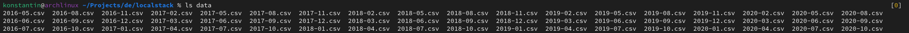

Docker services:

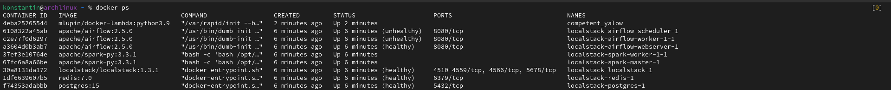

Airflow webserver:

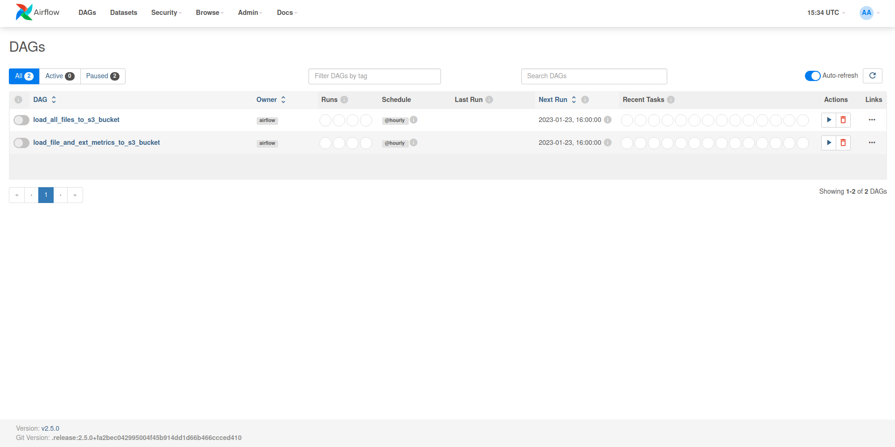

Spark master web ui:

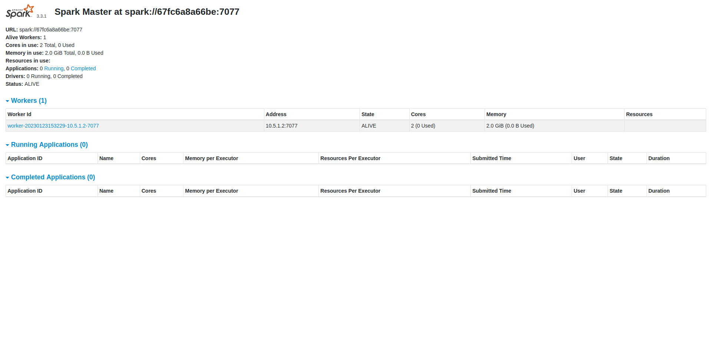

### After airflow dag has completed

Aiflow dag:

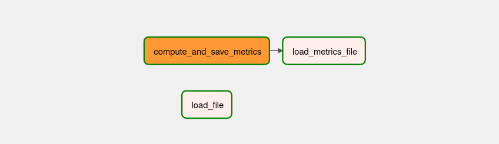

S3 bucket:

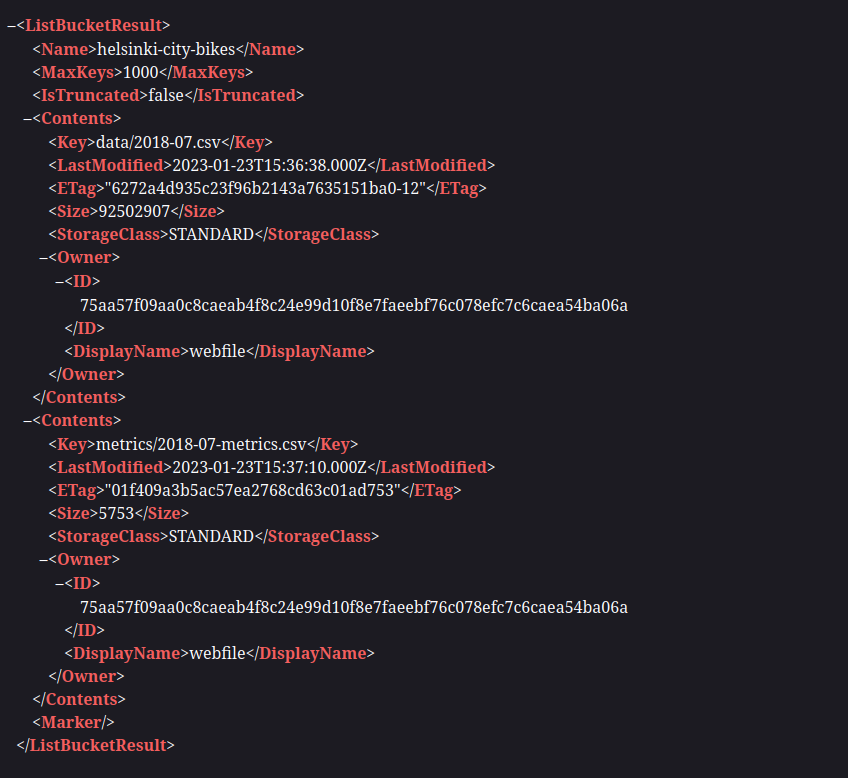

Running lambdas:

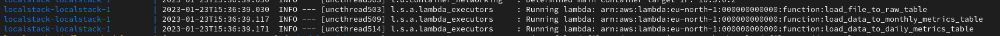

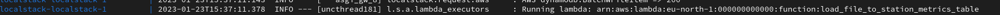

Writing to dynamodb:

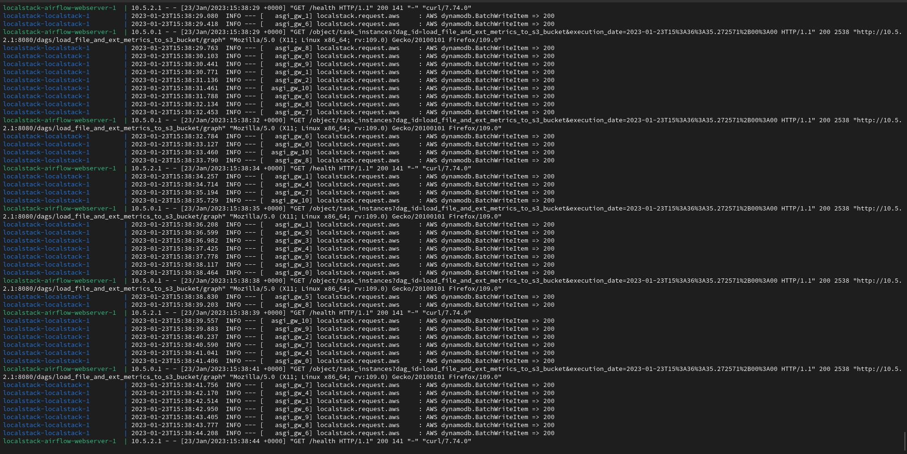

Scan of helsinki_city_bikes_monthly_metrics table:

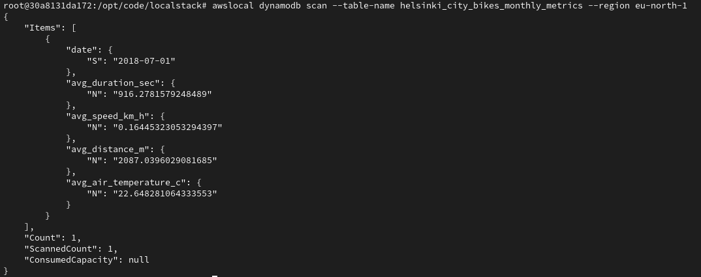

Completed spark application:

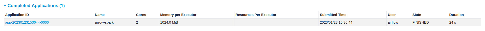

Tableau visualisation:

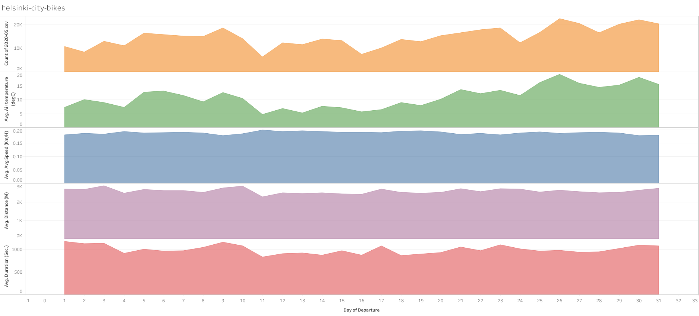
