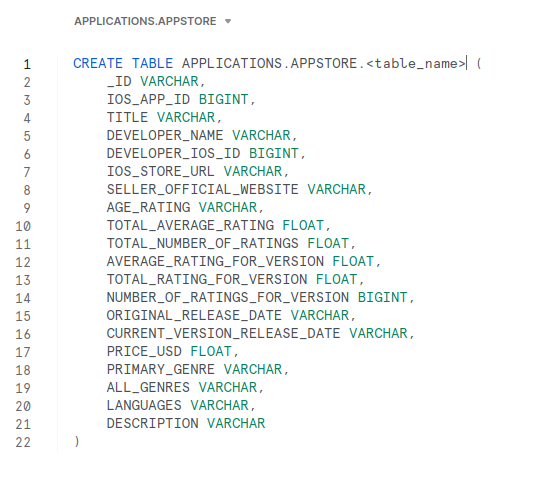
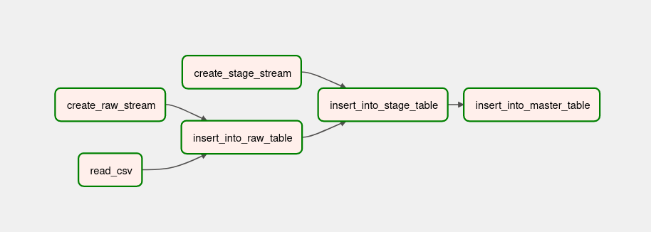
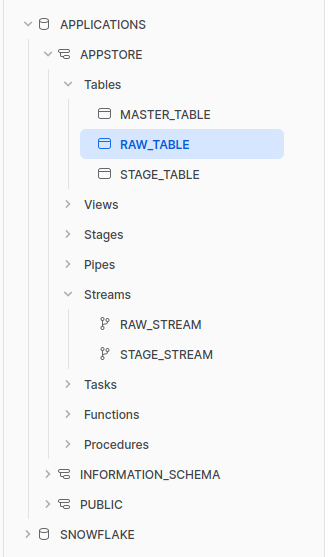
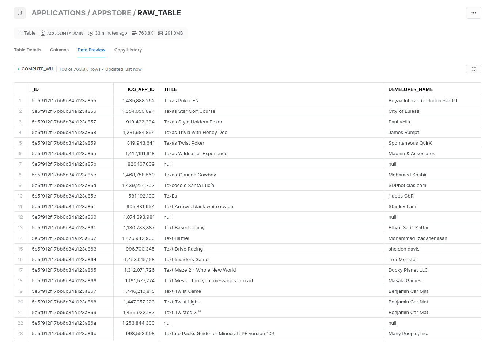

# Snowflake

## Airflow

Quick guide on how to install Airflow locally:

* You should already have python and pip installed

```shell
pip install -r requirements.txt
```

```shell
airflow db init
```

```shell
airflow users create \
    --username admin \
    --password password \
    --firstname Firstname \
    --lastname Lastname \
    --role Admin \
    --email email@example.com
```

* Edit the airflow.cfg file

```python
# Whether to load the DAG examples that ship with Airflow. It's good to
# get started, but you probably want to set this to ``False`` in a production
# environment
load_examples = False
...
# Whether to enable pickling for xcom (note that this is insecure and allows for
# RCE exploits).
enable_xcom_pickling = True
```

```shell
airflow webserver --port 8080
```

```shell
airflow scheduler
```

* Now you can go to [localhost:8080](http://localhost:8080) and login to airflow as admin

## Snowflake

* Create RAW/STAGE/MASTER table 



## Results






