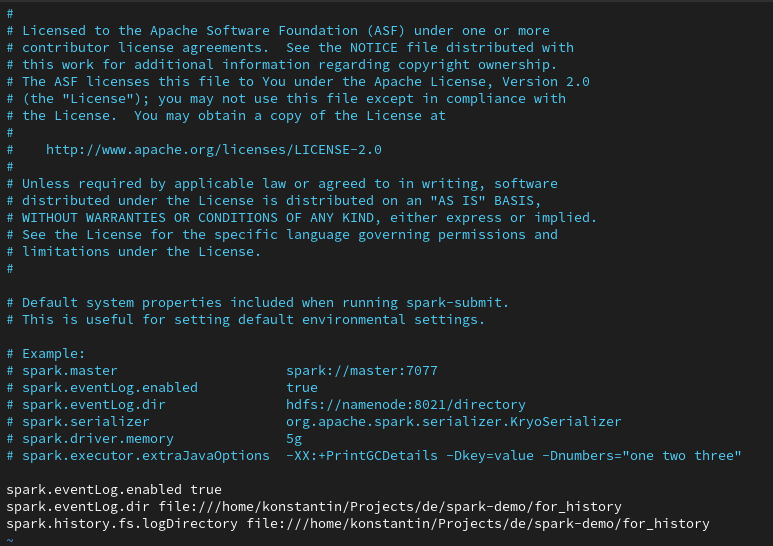
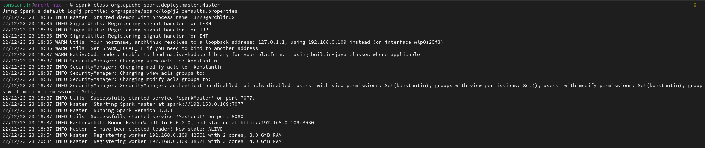
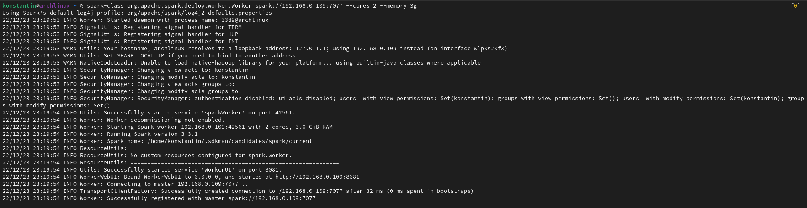
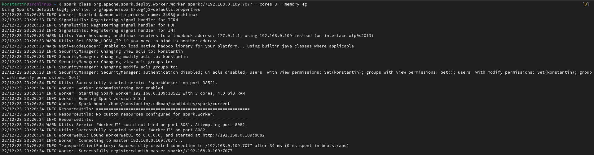
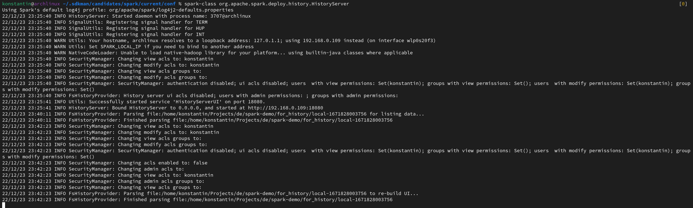
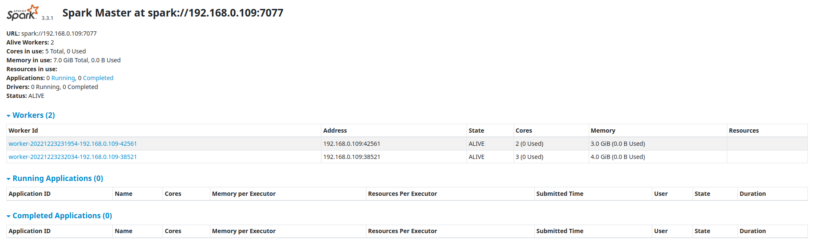
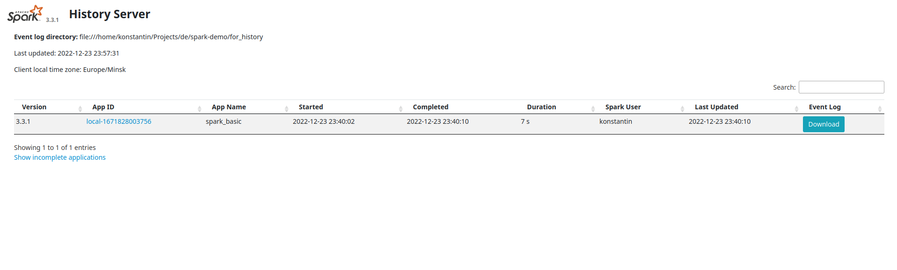
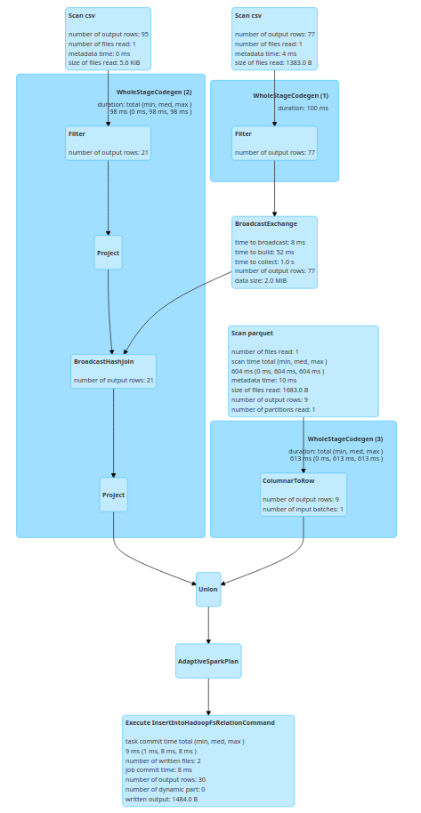

### About 3_Spark_Basics

Here are some results from Spark configuration and running spark-basics.py:

**spark-defaults.conf:**

**Start Master node:**

**Start Worker nodes:**

* First:

* Second:

**Start History server:**

### Results:

**Spark Master UI with Workers:**

**Spark History Server UI:**

**Execution plan:**

